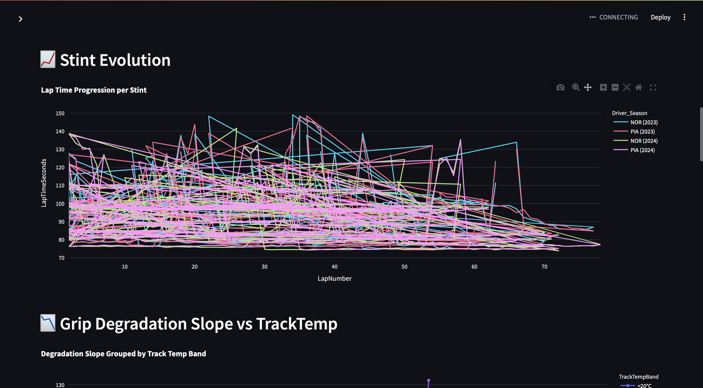
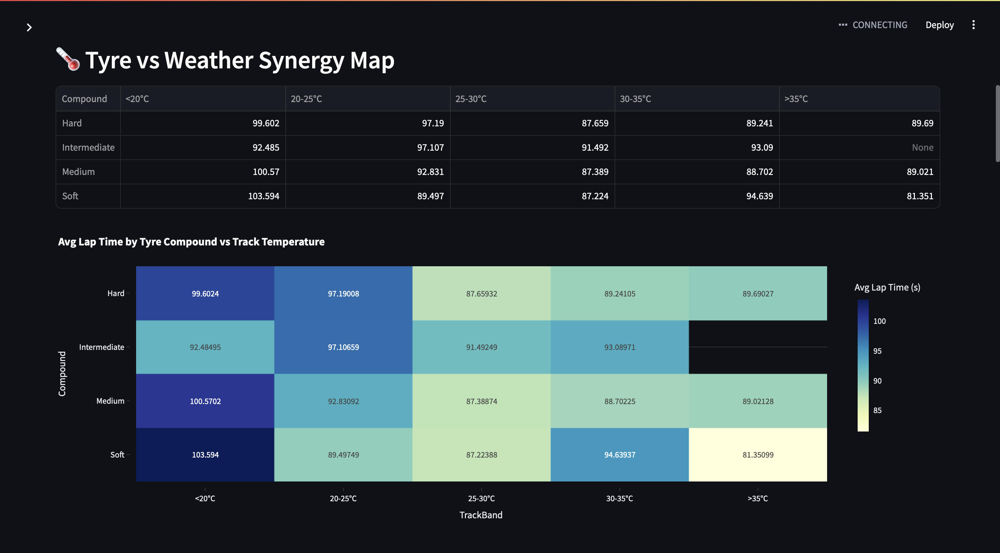
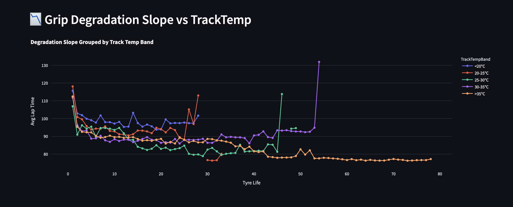
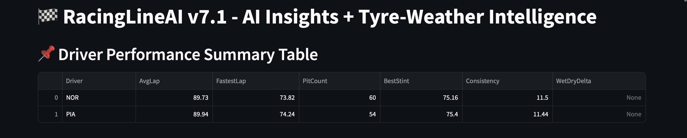

# 🧠 RacingLineAI – F1 Race Strategy & Tyre Degradation Intelligence Tool

**RacingLineAI** is a cutting-edge race intelligence platform designed to replicate the analytics mindset of a modern Formula 1 strategy engineer. It uses telemetry, weather data, tyre performance modeling, and regression-based ML techniques to break down every race, stint, and pit stop into data-driven insights.

Built using **FastF1**, **Pandas**, **Scikit-learn**, and **Streamlit**, RacingLineAI is modularized, interactive, and engineered to be extensible for future use by motorsports data teams.

---

## 🧩 Core Objective

> Build a modular F1 strategy platform that analyzes race telemetry, tyre usage, weather conditions, and driver performance through a combination of traditional analytics and machine learning regression.

---

## 🚦 What RacingLineAI Does

### 🧠 Real-World Alignment with F1 Team Use Cases

| Racing Team Use Case                            | RacingLineAI Feature                                                   |
|-------------------------------------------------|------------------------------------------------------------------------|
| Strategy Optimization & Pit Prediction          | 🔁 **Stint & Pit Timeline Analyzer**                                   |
| Tyre Compound Selection Under Weather Variants  | 🌡️ **Tyre vs TrackTemp & Rainfall Synergy Heatmap**                    |
| Tyre Wear Modeling                              | 📉 **Grip Degradation Modeling via Regression (TyreAge ~ LapTime)**    |
| Driver Sector Comparison                        | ⏱️ **Sector Pace Analyzer with Session-wise Delta Charts**             |
| AI-Powered Insights                             | 🧮 **Predictive Modeling for Degradation Slopes using Linear Regression** |
| Real-Time Dashboard for Strategy Engineers      | 🖥️ **Streamlit Modular App with Session Selection & Caching**          |

---

## 🧬 Technical Features & ML Work

### 1. 📊 **Stint & Pit Strategy Analyzer**
- Extracts stints, compounds, and pit laps using FastF1 telemetry
- Generates a per-driver **pit timeline** + average lap pace per stint
- Enables visual inspection of undercut/overcut potential

> 🛠️ `strategy_analysis.py` parses all pit windows, tyre data, and stint transitions from the lap-by-lap metadata.


---

### 2. 🌡️ **Tyre vs Weather Synergy Map**
- Builds a **heatmap**: `Compound × TrackTemp Band` → `Avg LapTime`
- Enables comparison of compound behavior in hot, mild, and wet conditions
- Uses grouped binning logic on real telemetry + weather data

> 🧮 Helps identify ideal compounds in various track temperatures (like Norris’s heat sensitivity or Piastri’s cold tyre warmup issues).

---

### 3. 📉 **Grip Degradation vs Track Temperature (ML Regression)**
- Uses `LapTime ~ TyreAge` regression, segmented by `TrackTemp`
- Models degradation **slopes** for each tyre compound per stint
- Uses **Linear Regression** (via `scikit-learn`) to plot and compare grip loss across temperatures

> 📘 Used to answer: *"How much faster do Mediums degrade in hotter conditions?"*


---

### 4. ⏱️ **Driver Sector Comparison Dashboard**
- Visualizes driver sector performance across sessions
- Highlights deltas vs leader or selected rival
- Offers strategic visibility into:
  - Sector-specific weaknesses
  - Consistency over stints

> 💡 Useful for role-based comparison like Piastri vs Norris in S1/S2/S3.

---

## 💡 Sample Insights Enabled

| Scenario                                                   | Insight Example                                                                 |
|------------------------------------------------------------|----------------------------------------------------------------------------------|
| High track temp in Qatar 2023                              | Soft tyres degrade ~3x faster than Mediums above 42°C                           |
| Alonso vs Russell stint comparison                         | Alonso conserved tyres longer via lower corner-entry speed                      |
| Rainfall & Intermediates at Zandvoort                      | Intermediates underperformed if deployed too early (<0.3mm rain accumulation)   |
| Sainz degradation profile                                  | Linearly degrading Mediums with a slope of +0.25s/lap at 38°C track temperature |

---

## 📚 ML & Statistical Methods Used

| Model/Technique                    | Purpose                                  |
|-----------------------------------|------------------------------------------|
| Linear Regression                 | Grip degradation analysis (per compound) |
| Binning + Aggregation             | Weather-tyre synergy heatmap             |
| Pandas GroupBy + Filtering        | Stint & lap window segmentation          |
| Rolling Averages & Moving Means  | Lap time smoothing                       |
| Caching with `FastF1.Cache`       | Speed up data processing                 |

---

## ✅ To Run It Locally

```bash
# Clone the repository
git clone https://github.com/osp06/RacinglinAi.git
cd RacinglinAi

# Install dependencies
pip install -r requirements.txt

# Launch the app
streamlit run streamlit_app.py


