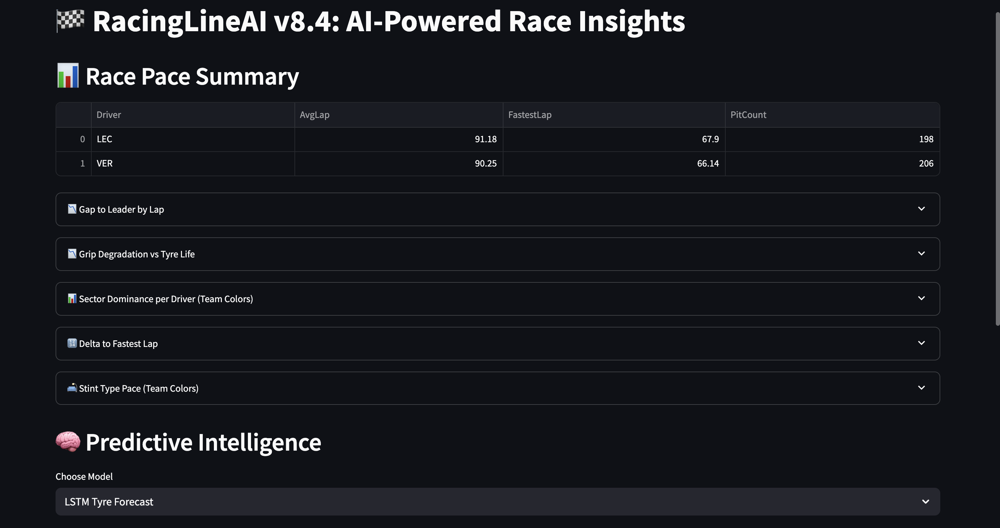
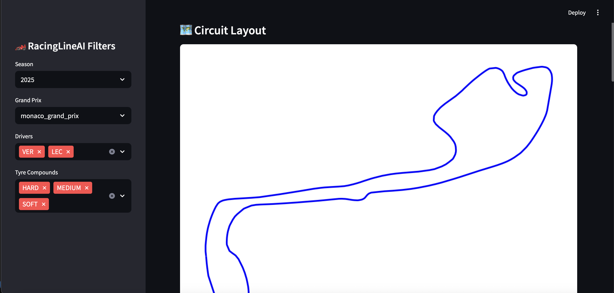
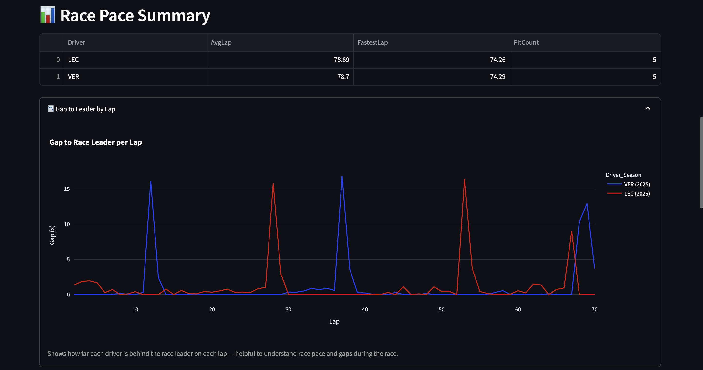
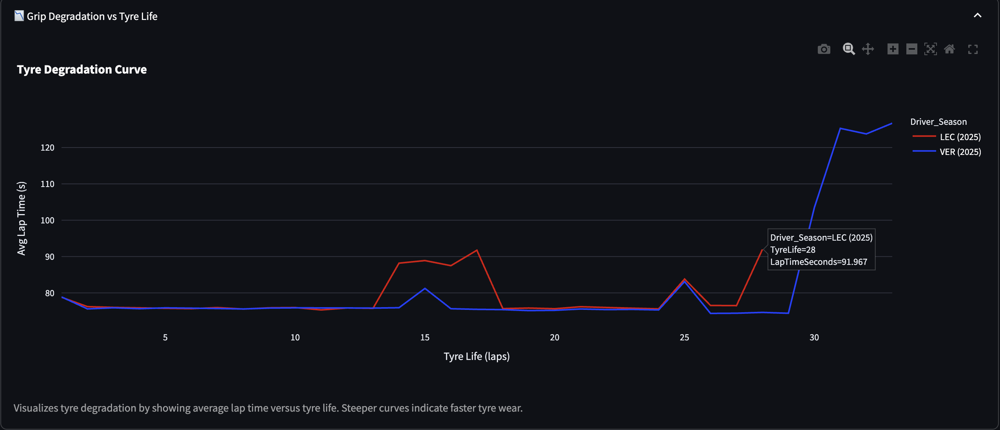
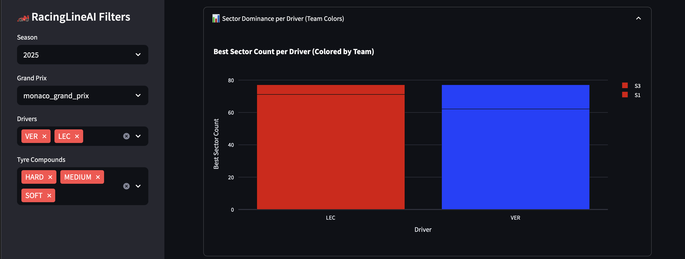
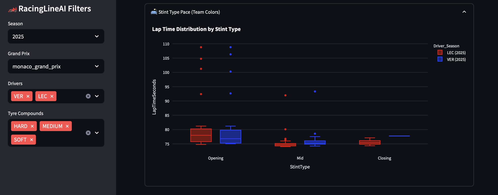
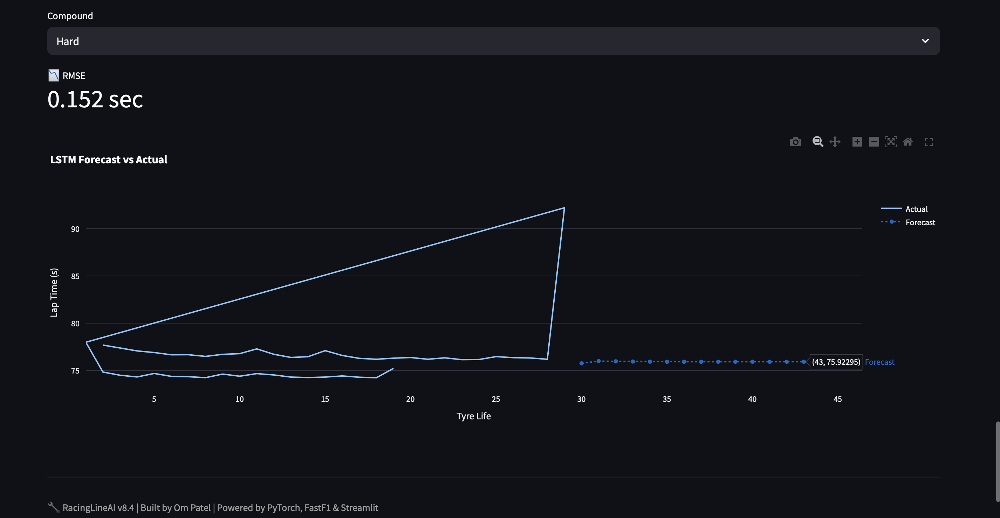
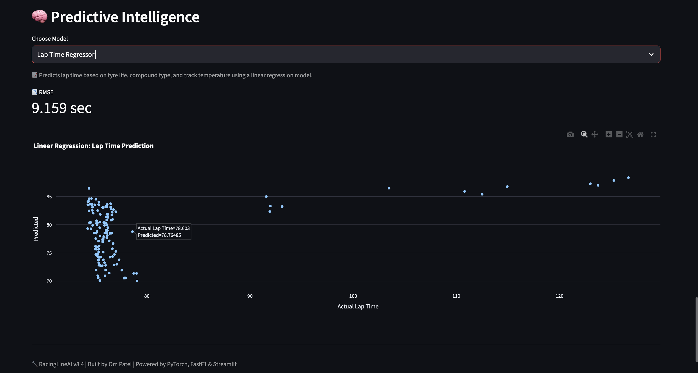
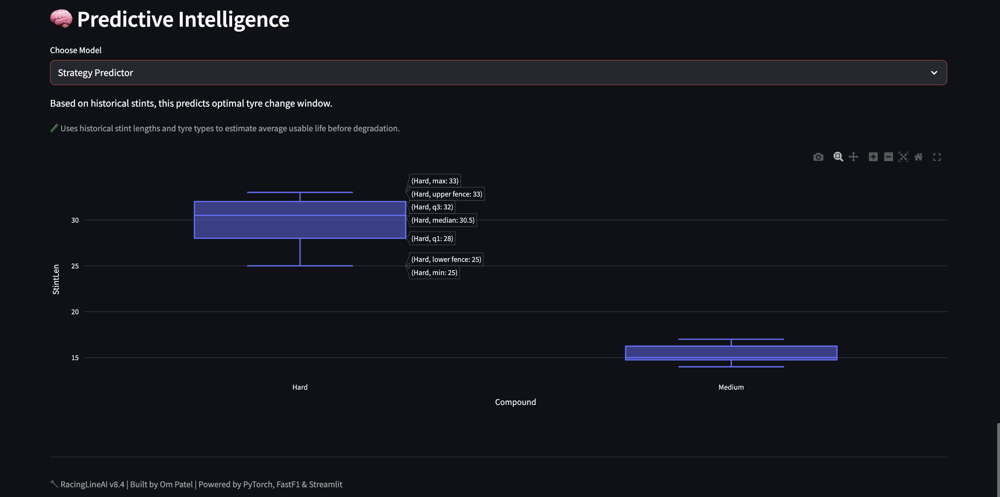

# 🏁 RacingLineAI v8.4 — AI-Powered Formula 1 Race Insights

RacingLineAI is an advanced interactive dashboard designed to analyze, visualize, and predict Formula 1 race data leveraging machine learning and telemetry data. The platform provides detailed race pace insights, tyre degradation analysis, sector dominance visualization, and predictive intelligence models like LSTM-based tyre life forecasting, lap time regression, and strategy prediction.

---

## 🚀 Features

- **Season & Race Filtering:** Select specific seasons (2018-2025) and Grand Prix events to analyze.
- **Driver & Tyre Compound Filters:** Compare performance for chosen drivers and tyre compounds.
- **Circuit Layout Visualization:** Displays the track layout with telemetry from fastest laps.
- **Race Pace Summary:** Aggregates average lap times, fastest laps, and pit stops per driver.
- **Gap to Leader Visualization:** Lap-by-lap gap analysis to the race leader.
- **Tyre Degradation Curves:** Visualizes lap time increase relative to tyre life.
- **Sector Dominance Charts:** Shows driver strengths across different track sectors.
- **Delta to Fastest Lap:** Tracks lap delta compared to driver’s best lap.
- **Stint Type Lap Time Distribution:** Analyze opening, mid, and closing stint pace.
- **Predictive Intelligence:**
  - **LSTM Tyre Forecast:** Forecasts lap times over tyre life using an LSTM model.
  - **Lap Time Regression:** Predicts lap times based on tyre life, compound, and track temperature.
  - **Strategy Predictor:** Estimates optimal tyre stint length based on historical data.

---


## 📸 Screenshots

### Circuit Layout Visualization
  
*Telemetry-based visualization of the selected Grand Prix circuit.*

---

### Race Pace Summary
*Table showing average lap times, fastest laps, and pit counts per driver.*

---

### Gap to Leader by Lap
  
*Line chart visualizing lap-by-lap gap to the race leader.*

---

### Tyre Degradation Curve
  
*Shows lap time progression as tyres wear out.*

---

### Sector Dominance per Driver
  
*Bar chart of best sector times by driver, color-coded by team.*

---

### Delta to Fastest Lap Over Race
  
*Line chart showing lap time delta relative to each driver’s fastest lap.*

---

### Stint Type Pace Distribution
  
*Box plots showing lap time distribution for opening, mid, and closing tyre stints.*

---

### Predictive Intelligence: LSTM Tyre Forecast
  
*Forecasted lap times vs. actual lap times based on tyre degradation.*

---

### Predictive Intelligence: Lap Time Regression
  
*Scatter plot comparing actual vs predicted lap times from regression model.*

---

### Predictive Intelligence: Strategy Predictor
  
*Box plots showing historical stint lengths for different tyre compounds.*

---

## 📈 Predictive Models Explained

### LSTM Tyre Forecast  
Uses a Long Short-Term Memory neural network to predict future lap times as tyre performance degrades over time. This helps anticipate how a driver’s pace will evolve beyond recorded laps.

### Lap Time Regressor  
A linear regression model that predicts lap time by considering factors like tyre compound, tyre life, and track temperature. Useful for quick estimations of lap performance under varying conditions.

### Strategy Predictor  
Analyzes historical stint lengths and tyre compounds to provide insights on optimal tyre change windows, helping with race strategy planning.

---

## 🛠️ Tech Stack

- **Python** for backend data processing and machine learning.
- **Streamlit** for interactive dashboard frontend.
- **FastF1** for fetching and processing official Formula 1 telemetry and lap data.
- **PyTorch** for building and training the LSTM predictive model.
- **Scikit-learn** for regression modeling and metrics.
- **Plotly** and **Matplotlib** for rich interactive and static visualizations.
- **Pandas** and **NumPy** for data manipulation.

---

## 📋 Installation & Setup

1. **Clone the repository**
```bash
git clone https://github.com/osp06/racinglinai.git
cd racinglineai

2. **Create and activate a virtual environment (recommended)**
python -m venv venv
source venv/bin/activate   # Linux/macOS
venv\Scripts\activate      # Windows

3. **Install required packages**
pip install -r requirements.txt

4. **Download processed race data**
 Ensure the folder data/processed/ contains the CSV files for all races from 2018 to 2025 named like all_races_combined_2018.csv, ..., all_races_combined_2025.csv. 

5. ** Run app **
streamlit run streamlit_app.py

