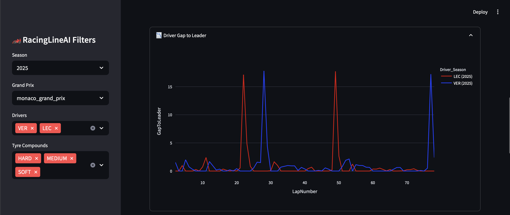
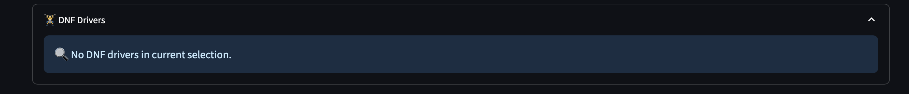
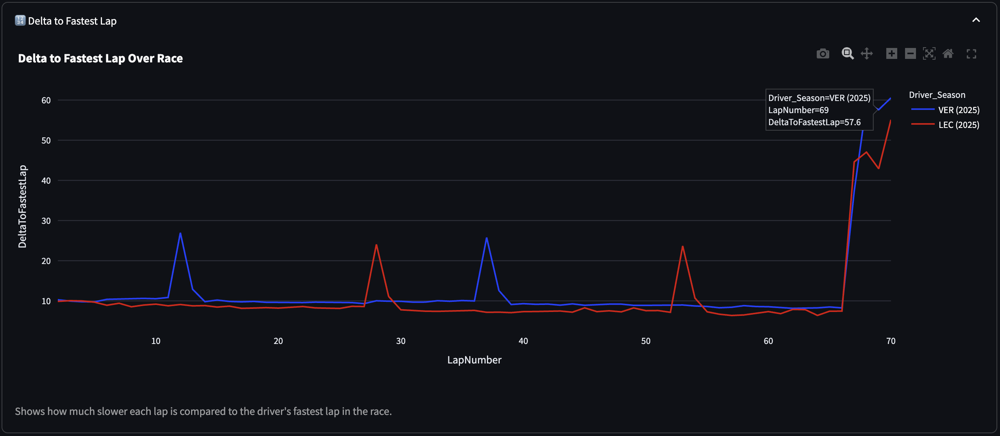
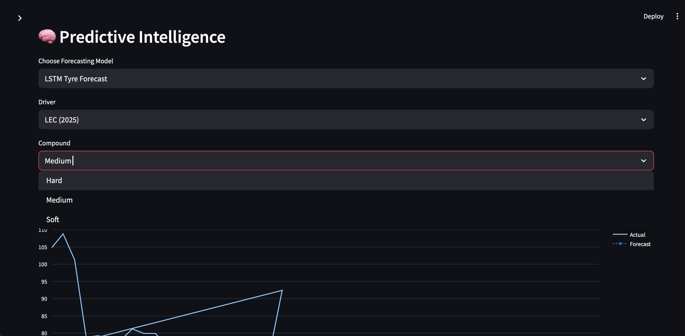
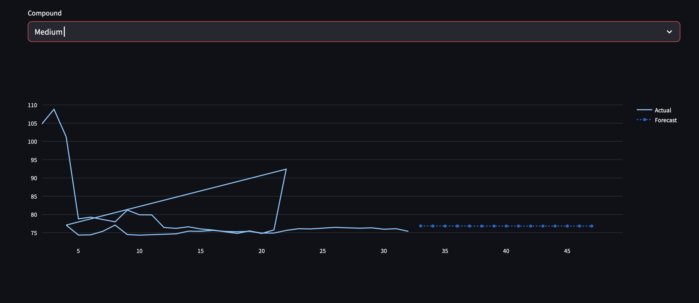
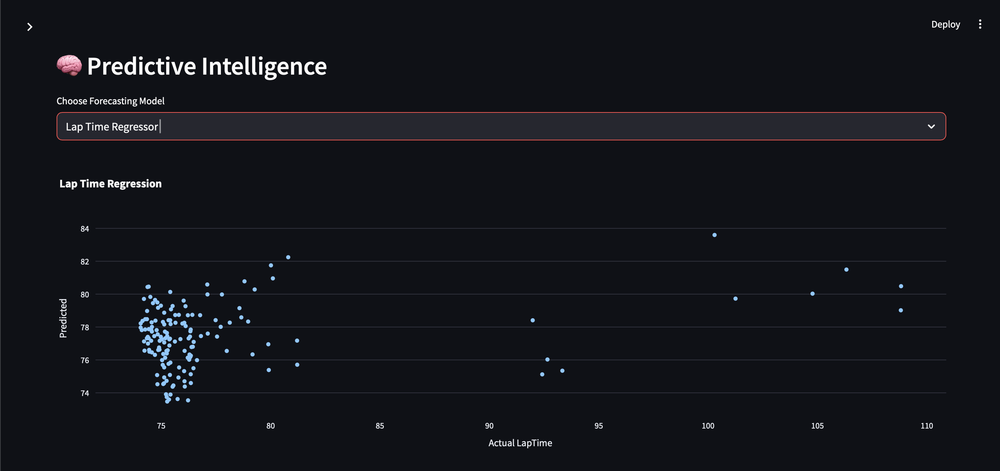
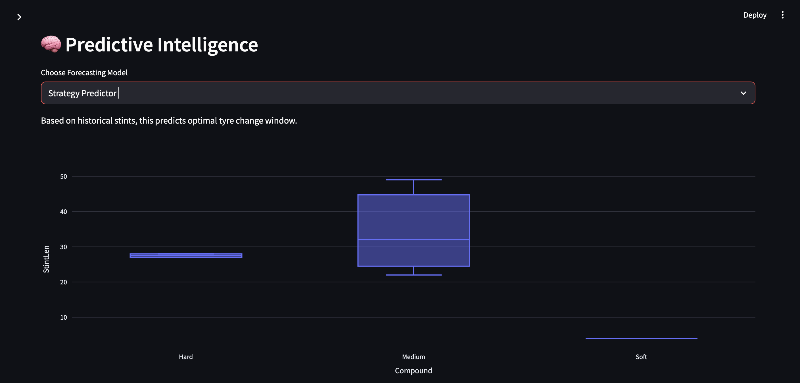

# 🏁 RacingLineAI

**RacingLineAI** is an advanced F1 race analytics platform powered by **PyTorch**, **FastF1**, and **Streamlit**, designed to provide deep insights into driver performance, tyre degradation, weather behavior, and AI-driven race predictions across multiple seasons.

Built by **Om Patel**, this project blends real-time data processing, race visualization, and machine learning models to help engineers, fans, and analysts decode what’s really happening on the track.

---

## 🚀 Features Overview

### 🎯 Filters (Sidebar)
- **Season & Grand Prix**: Filter race data from 2021 to 2025 (or latest available).
- **Drivers**: Compare multiple drivers side-by-side.
- **Tyre Compounds**: Focus on specific strategies (Soft, Medium, Hard, Inter, Wet).


---

## 📊 Visualization Panels & Graphs

### 🗺️ Circuit Layout
Plots the fastest lap telemetry (X-Y) from FastF1 to show the circuit trace.


### 📉 Driver Gap to Leader
Displays the time delta between each selected driver and the lap leader throughout the race.

- **Color-coded by Driver_Season**.
- Shows who was gaining or losing time across stints.

### 📉 Grip Degradation (Driver-Colored)
Shows average lap time vs. tyre life per driver across dry or wet compounds.
- Helps visualize tyre performance over stints.


- **Color-coded using dynamic team colors.**

### 📊 Sector Dominance per Driver (Team Colors)
Bar chart showing how many times each driver had the fastest time in each sector (S1, S2, S3).


- Stacked per sector, **colored by team**.

### 🏋️ DNF Drivers
List of drivers who retired or failed to complete enough laps.
- Identified via `IsDNF` logic comparing laps to race max.


### 🔢 Delta to Fastest Lap
Shows the lap-by-lap gap between a driver and the **fastest lap overall**.
- Excellent for performance benchmarking.


### 🛋️ Stint Type Pace
Box plot of lap times by **stint type**:
- Opening, Mid, Closing
- Helps understand tyre strategy effectiveness across phases.


---

## 🧠 Predictive Intelligence Module

### 1. **LSTM Tyre Forecast** (Deep Learning)
- Uses PyTorch LSTM to model degradation over tyre life.
- Forecasts next 15 laps of lap time for a selected driver and compound.
- Auto-scales data using `MinMaxScaler` and reshapes to 3D.



### 2. **Lap Time Regressor** (Linear Regression)
- Predicts lap times using `TrackTemp`, `TyreLife`, and compound encoding.
- Visual scatter plot of actual vs predicted lap times.


### 3. **Strategy Predictor**
- Historical box plots of stint lengths by compound.
- Useful to understand optimal tyre change windows.


---

## ⚙️ Technology Stack

| Component      | Tool                        |
|----------------|-----------------------------|
| UI Framework   | Streamlit                   |
| Data Source    | FastF1 API (`get_session`)  |
| ML Framework   | PyTorch, Scikit-learn       |
| Visualization  | Plotly, Matplotlib          |
| Data Storage   | Pre-processed CSVs (2021–2025) |
| Forecasting    | LSTM Model in PyTorch       |

---

## 🛠️ Project Structure

```bash
📦 RacingLineAI/
├── data/
│   └── processed/
│       ├── all_races_combined_2021.csv
│       ├── ...
│
├── streamlit_app.py       # Main Streamlit dashboard
├── requirements.txt
├── README.md              # You are here
└── .venv/                 # Virtual environment


### 📈 How Graphs Are Colored
Driver_Season = Driver + Year (e.g. VER (2023))
Dynamic mapping ensures team color changes per season are reflected across all plots.
Automatically updates if driver-team associations change in newer seasons.

### 🔮 Future Enhancements

✅ Short-term (v8.3+)
Add Pit Stop Prediction Model using classification.
Enable real-time race data ingestion for live races.
Introduce Team vs Team analysis.

🚧 Medium-term
Add clustering of driver styles using k-means or PCA.
Build a Pit Strategy Optimizer based on compound degradation.

🌐 Long-term
Integrate Live Timing (via sockets or F1TV API if available).
Deploy on cloud with auto-refresh (Render / HuggingFace Spaces).
Add user login & data bookmarking via Firebase.

🧪 How to Run Locally
git clone https://github.com/yourusername/RacingLineAI.git
cd RacingLineAI
python -m venv .venv
source .venv/bin/activate       # or .venv\Scripts\activate on Windows
pip install -r requirements.txt
streamlit run streamlit_app.py
